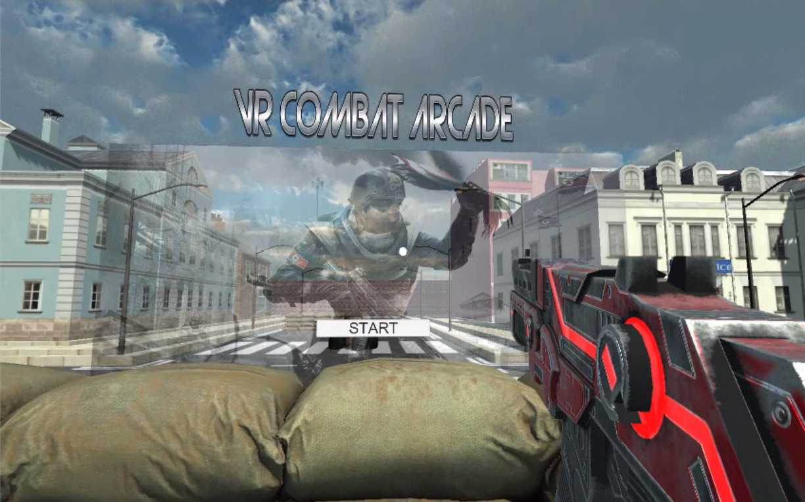
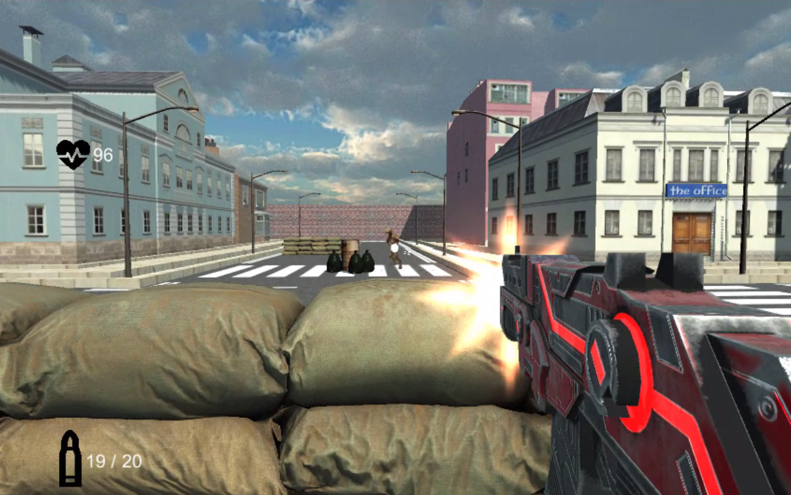
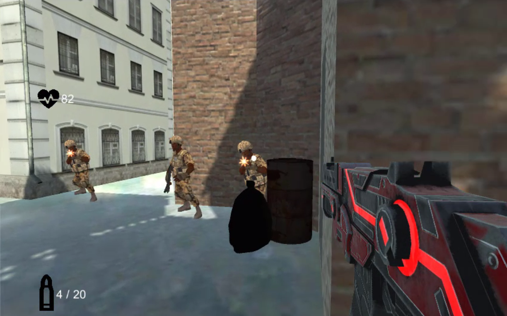

# **VR Combat Arcade**
### Juego simple con Google VR en Unity.

**Demo (Video)**: https://youtu.be/TAILduu6Hu0

**App (Android)**: https://github.com/oscarjcg/vr-combat-arcade/tree/master/APK

**Fecha**: Enero, 2018

**Descripción**: El jugador se enfrenta a varios enemigos soldado en sucesivas zonas. Cada zona tiene 2 o 3 enemigos. Para pasar a la siguiente zona hay que eliminar a los enemigos activos. Tras la última zona se calcula una puntuación final.

**Características**:
* Controles (mando inalámbrico):
    * Apuntar: Movimiento del dispositivo VR
    * Disparar: 'R1'
    * Recargar: 'X'
    * Agacharse: 'B'
* Controles (Editor Unity):
    * Apuntar: Alt + mouse
    * Disparar: Alt + click primario
    * Recargar: 'R'
    * Agacharse: 'C'
* 7 zonas con enemigos que disparan

**Entorno de desarrollo**:
* **Sistema operativo:** Windows 10 64 bits
* **Unity:** Unity 2017.4.1f1 Personal 64 bits
* **Microsoft Visual Studio Community 2017:** 15.8.7
